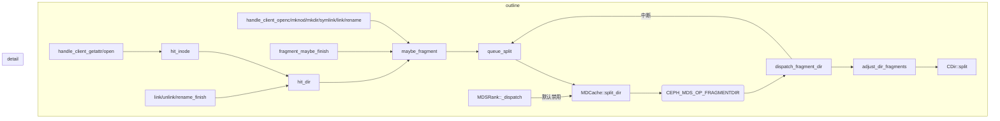

# this is personal introduction

- test
- test



```mermaid
graph TD
subgraph outline
handle_client_openc/mknod/mkdir/symlink/link/rename -->maybe_fragment
fragment_maybe_finish --> maybe_fragment
handle_client_getattr/open --> hit_inode
hit_inode --> hit_dir
link/unlink/rename_finish --> hit_dir
hit_dir --> maybe_fragment
maybe_fragment --> queue_split
queue_split --> MDCache::split_dir


MDSRank::_dispatch --默认禁用--> MDCache::split_dir

MDCache::split_dir --> msg(CEPH_MDS_OP_FRAGMENTDIR)
msg(CEPH_MDS_OP_FRAGMENTDIR) --> dispatch_fragment_dir
dispatch_fragment_dir --中断--> queue_split
dispatch_fragment_dir--> adjust_dir_fragments
adjust_dir_fragments-->CDir::split
end
subgraph detail

end
```

```
int main {

}
```
