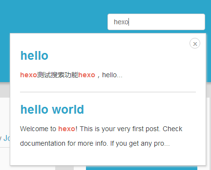

# hexo-search-plugin

这个插件是针对那些主题没有集成搜索功能的，我们喜欢这些主题但是又想用搜索功能，除了那些百度站内搜索以外，我们还可以本地搜索，使用hexo-generator-search插件生成搜索文档，然后自己写ccs、js来进行本地搜索

使用它可以实现如下效果：



## 配置教程
1. 下载一个自己喜欢的主题
1. 安装hexo-generator-search插件
1. 配置项目的_config.yml在最后添加如下（详细配置可以去npm商店或者git仓库看文档）
```
search:
	path: search.xml
	field: post
	content: true
```
1. 切换到自己细化的主题
1. 把search.js和load.js放到主题下的source文件夹下的js目录下
1. 然后找个公共文件，引入这俩个js（如果不会找公共的文件，可以随便搜索一个js目录下有的js文件，根据文件名字判断哪个是公共的，一般符合开发规范的都是在footer.ejs中引入）
1. 把search.styl放到主题下的source文件夹下的css目录下
1. 然后在style.styl中引入
1. 把search.ejs放到layout中
1. 然后在一个公共文件引入，可以和上面引入js的是同一个页面
1. 配置主题下的_config.yml
```
local_search:
	enable: true  #搜索开关
	location: "right: 50px;top: 30px;" #搜索框位置top/left/bottom/right
	facade: ""  #搜索框样式
```
------

## 联系方式
* QQ: 305530751
* EMAIL: leruge@163.com
------

## 捐赠我
### 微信

------
### 支付宝
